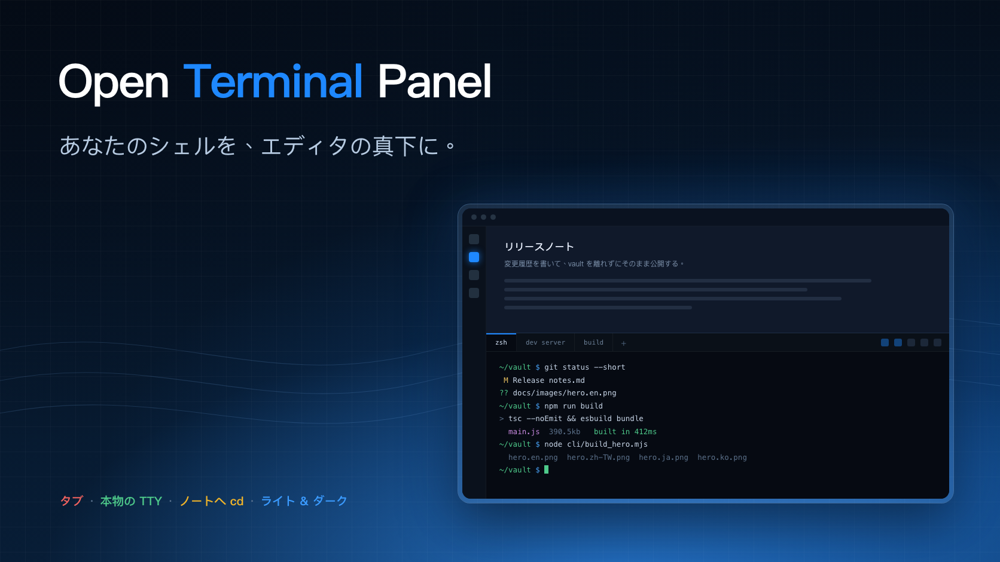

<!-- intl-release: locale-samples
     This file is the Japanese translation of README.md and is expected to
     contain CJK text. English source of truth: README.md -->

<div align="center">

[English](README.md) · [繁體中文](README.zh-TW.md) · [日本語](README.ja.md) · [한국어](README.ko.md)



# Open Terminal Panel

**本物のターミナルを Obsidian のエディタ直下にドッキングさせるプラグイン。複数のシェルをタブで持ち、それぞれが自前の TTY を持ちます。デスクトップ専用。**

[](../../releases/latest)
[](../../releases)
[](#インストール)
[](#インストール)
[](#インストール)
[](LICENSE)

Obsidian の中で動く本物のターミナル。パネルは**エディタの下**に開きます。エディタウィンドウのターミナルは本来そこにあるべきだからです。複数のシェルはタブで並びます。

[📥 ダウンロード](../../releases/latest) · [💡 できること](#できること) · [⚙️ 設定](#設定) · [🖥️ 本物の TTY](#仕組み) · [🐞 問題を報告](../../issues/new)

</div>

---

見せかけのシェルではありません。どのタブにも本物の TTY が割り当てられるので、`vim`、`htop`、`git rebase -i`、開発サーバー、色付きの出力まで、普段のターミナルアプリとまったく同じように動きます。

> デスクトップ専用です。ネイティブの pty を駆動するため、モバイルでは動作しません。


## できること

- **エディタの下に開き**、開いたまま終了すれば次回起動時にも戻ってきます。高さは一度決めたエディタ領域に対する比率で、区切り線はそのままドラッグできます。
- **タブ。** 各タブが独立したシェルです。ひとつ閉じてもそのシェルだけが終了し、他には影響しません。終了したシェルも出力は残るので、何が起きたのか後から読めます。
- **フォルダへ一発で移動。** ボタンひとつで vault へ `cd`、もうひとつで編集中のノートのフォルダへ `cd`。パスは引用符で囲まれるので、`$(id)` という名前のフォルダは「入力」されるだけで実行されません。
- **専用のパレット。** ライトかダーク。Obsidian のテーマにはあえて追随しません。ターミナルの 16 の ANSI 色は、読めるだけのコントラストを保つために固定の基準が要るからです。
- **6 つのインターフェース言語**。既定では Obsidian に追随します。

## インストール

### コミュニティストアから

**Open Terminal Panel** をインストールして有効化し、パネルを開きます。初回だけ、TTY を提供するネイティブモジュール `node-pty` のダウンロードを求められます。

ストアが配布するのは `main.js`、`manifest.json`、`styles.css` だけで、ネイティブバイナリはプラグインと一緒には運べません。そこでパネルは URL をそのまま表示します。このリポジトリ自身のリリースに置かれたアセットで、プラグインのバージョンとお使いのプラットフォームに対応したものです。あとはボタンを押すのを待つだけです。バックグラウンドで何かがダウンロードされることはなく、アーカイブはプラグイン自身のフォルダにしか展開されません。ダウンロードしたファイルの SHA-256 はインストール後に表示され、同じチェックサムがリリースの隣に `node-pty-<platform>.tar.gz.sha256.txt` として公開されています。

自分の手で入れたい場合は、そのアーカイブを `<vault>/.obsidian/plugins/open-terminal-panel/` に展開してください。

ビルド済みコンポーネントを配布しているのは macOS の Apple silicon と Intel です。このプロジェクトがビルドして検証できるのがその 2 つだからです。Windows と Linux ではパネルがその旨を表示するので、ソースからインストールしてください。その場合 `node-pty` はマシン上でビルドされます。

### ソースから

```bash
git clone https://github.com/aione314159/open-terminal.git
cd open-terminal
./cli/install_obsidian_plugin.sh            # obsidian.json で最初に見つかった vault
./cli/install_obsidian_plugin.sh /path/to/vault
```

バンドルをビルドし、vault にコピーし、あなた自身の `npm install` から `node-pty` を入れます。この経路ではダウンロード手順は現れません。あとは Obsidian でコミュニティプラグインを再読み込みし、**Open Terminal Panel** を有効化してください。

## 使い方

| 場所 | 動作 |
|---|---|
| リボンのアイコン | パネルを開く |
| コマンドパレット | パネルを開く／切り替える、新しいタブ |
| タブバーの `+` | 設定した作業フォルダで新しいタブ |
| タブを中クリック | そのタブを閉じる |
| ヘッダーのボタン | vault へ cd · ノートのフォルダへ cd · 画面消去 · 再起動 · ライト／ダーク |

シェルが終了したタブは出力を保持し、タブバーでは取り消し線が付きます。再起動を押せば同じフォルダで生きたシェルが戻ります。

## 設定

| 設定 | 既定値 | 補足 |
|---|---|---|
| 作業フォルダ | vault のフォルダ | 新しいタブの開始位置。`~` は展開されます。存在しないフォルダは vault に戻ります。 |
| シェルのパス | `$SHELL` | ログインシェルとして起動するので `PATH` とプロファイルが完全になります。Obsidian は GUI から起動されるため、そのままではほとんど何も継承しません。 |
| 起動時に必ず開く | オフ | 毎回の起動でパネルを開きます。オフなら保存されたワークスペースに従い、終了時に開いていた場合だけ戻ります。 |
| パネルの高さ | 30 % | エディタ領域に対する比率。 |
| パレット | ダーク | ターミナルのみ。Obsidian のテーマには追随しません。 |
| フォントサイズ | 12 px | すべてのタブに適用されます。 |
| インターフェース言語 | Obsidian に追随 | English と繁體中文は査読済み。日本語、한국어、Deutsch、Français はコミュニティ翻訳です。 |

設定タブの「セットアップをテスト」は、シェルのパス、作業フォルダ、ネイティブコンポーネントの導入状況を確認します。

## 仕組み

```
main.ts      プラグイン本体、設定タブ、エディタ下へのパネル配置
view.ts      パネル：タブバー、ヘッダー操作、表示中のセッション 1 つ
session.ts   1 つのシェル —— pty に紐づいた xterm インスタンス
runtime.ts   初回起動時のネイティブコンポーネントのダウンロードと展開
pty.ts       絶対パスでプラグインフォルダから node-pty を読み込む
theme.ts     16 色パレット 2 種類
i18n.ts      文字列の参照。テーブルは src/locales/ にあります
```

`node-pty` はネイティブモジュールなので esbuild ではバンドルできず、Obsidian のモジュール解決パス上にもありません。だからこそ絶対パスでプラグインフォルダから読み込み、そこに置くための初回ダウンロードが必要になります。

パネルの配置は root split の最新の leaf に対する `createLeafBySplit` で、サイドバーの中ではなくエディタの下に着地します。高さは leaf のタブコンテナへの `setDimension` で決めますが、同階層のすべてに設定します。サイズ未指定のコンテナは「できるだけ小さく」と解釈され、ターミナルが領域を丸ごと占めてしまうからです。`setDimension` は公開 API ではありません。将来の Obsidian が外した場合、パネルは既定の分割高さで開くだけで、使えなくなることはありません。

## 開発

```bash
npm install
npm run dev      # esbuild watch
npm run build    # tsc --noEmit + production bundle

./cli/pack_pty_runtime.sh          # このプラットフォーム向けに node-pty のアーカイブを作る
node cli/test_unpack.mjs           # プラグイン自身の展開処理で解いて検証する
node cli/build_hero.mjs            # docs/images/hero.<lang>.png を再生成する
```

言語をひとつ増やすには `src/locales/` にファイルを 1 つと、その `index.ts` に 1 行を足します。`src/locales/zh.ts` がキー集合の正解で、他のテーブルにキーが欠けているとビルドが落ちます。

リリース：`manifest.json` のバージョンでコミットにタグを打ち、`main.js`、`manifest.json`、`styles.css`、各プラットフォームの `node-pty-<platform>.tar.gz` と対応する `.sha256.txt` を添付します。

## ライセンス

MIT
