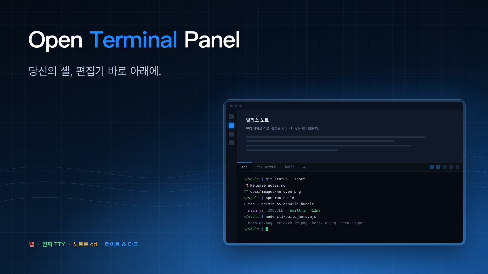

<!-- intl-release: locale-samples
     This file is the Korean translation of README.md and is expected to
     contain CJK text. English source of truth: README.md -->

<div align="center">

[English](README.md) · [繁體中文](README.zh-TW.md) · [日本語](README.ja.md) · [한국어](README.ko.md)



# Open Terminal Panel

**진짜 터미널을 Obsidian 편집기 바로 아래에 붙여 주는 플러그인. 여러 셸을 탭으로 두고, 각 탭이 자기 TTY를 가집니다. 데스크톱 전용.**

[](../../releases/latest)
[](../../releases)
[](#설치)
[](#설치)
[](#설치)
[](LICENSE)

Obsidian 안에서 도는 진짜 터미널. 패널은 **편집기 아래**에 열립니다. 편집기 창의 터미널은 원래 그 자리에 있어야 하니까요. 여러 셸은 탭으로 나란히 놓입니다.

[📥 내려받기](../../releases/latest) · [💡 기능](#기능) · [⚙️ 설정](#설정) · [🖥️ 진짜 TTY](#작동-방식) · [🐞 문제 신고](../../issues/new)

</div>

---

흉내만 낸 셸이 아닙니다. 모든 탭에 진짜 TTY가 붙으므로 `vim`, `htop`, `git rebase -i`, 개발 서버, 색이 들어간 출력까지 평소 쓰던 터미널 앱과 똑같이 동작합니다.

> 데스크톱 전용입니다. 네이티브 pty를 구동하므로 모바일에서는 실행되지 않습니다.


## 기능

- **편집기 아래에 열리고**, 열어 둔 채로 끝냈다면 다음 실행 때 다시 돌아옵니다. 높이는 한 번 정해 둔 편집 영역 대비 비율이며, 구분선은 그대로 끌어 옮길 수 있습니다.
- **탭.** 탭마다 독립된 셸입니다. 하나를 닫으면 그 셸만 종료되고 나머지는 그대로입니다. 종료된 셸도 출력이 남아 있어 무슨 일이 있었는지 나중에 읽을 수 있습니다.
- **폴더로 한 번에 이동.** 버튼 하나는 볼트로 `cd`, 다른 하나는 편집 중인 노트의 폴더로 `cd` 합니다. 경로에는 따옴표가 붙으므로 `$(id)`라는 이름의 폴더는 실행되지 않고 그대로 입력됩니다.
- **자체 팔레트.** 라이트 또는 다크. Obsidian 테마를 일부러 따라가지 않습니다. 터미널의 16개 ANSI 색은 읽히려면 고정된 대비 기준이 필요하기 때문입니다.
- **인터페이스 언어 6종**, 기본값은 Obsidian을 따라갑니다.

## 설치

### 커뮤니티 스토어에서

**Open Terminal Panel**을 설치하고 켠 뒤 패널을 엽니다. 처음 한 번은 TTY를 제공하는 네이티브 모듈 `node-pty`를 내려받을지 묻습니다.

스토어가 설치하는 것은 `main.js`, `manifest.json`, `styles.css`뿐이라 네이티브 바이너리는 플러그인과 함께 올 수 없습니다. 그래서 패널은 정확한 URL을 그대로 보여 줍니다. 이 저장소 자신의 릴리스에 올라간 에셋이며, 플러그인 버전과 사용 중인 플랫폼에 맞는 파일입니다. 그다음은 버튼을 누를 때까지 기다립니다. 백그라운드에서 내려받는 것은 없고, 압축은 플러그인 자신의 폴더에만 풀립니다. 내려받은 파일의 SHA-256은 설치 후 표시되며, 같은 체크섬이 릴리스 옆에 `node-pty-<platform>.tar.gz.sha256.txt`로 공개됩니다.

직접 넣고 싶다면 그 압축 파일을 `<vault>/.obsidian/plugins/open-terminal-panel/`에 풀어 주세요.

사전 빌드된 구성 요소는 macOS의 Apple silicon과 Intel용으로 배포합니다. 이 프로젝트가 빌드하고 검증할 수 있는 대상이 그 둘이기 때문입니다. Windows나 Linux에서는 패널이 그 사실을 알려 주므로 소스에서 설치하면 됩니다. 그 경우 `node-pty`는 해당 컴퓨터에서 빌드됩니다.

### 소스에서

```bash
git clone https://github.com/aione314159/open-terminal.git
cd open-terminal
./cli/install_obsidian_plugin.sh            # obsidian.json에서 처음 찾은 볼트
./cli/install_obsidian_plugin.sh /path/to/vault
```

번들을 빌드해 볼트에 복사하고, 직접 실행한 `npm install`에서 나온 `node-pty`를 함께 넣습니다. 이 경로에서는 내려받기 단계가 아예 나타나지 않습니다. 이어서 Obsidian에서 커뮤니티 플러그인을 다시 불러오고 **Open Terminal Panel**을 켜세요.

## 사용법

| 위치 | 동작 |
|---|---|
| 리본 아이콘 | 패널 열기 |
| 명령 팔레트 | 패널 열기 / 토글, 새 탭 |
| 탭 줄의 `+` | 설정한 작업 폴더에서 새 탭 |
| 탭 가운데 클릭 | 그 탭 닫기 |
| 헤더 버튼 | 볼트로 cd · 노트 폴더로 cd · 화면 지우기 · 재시작 · 라이트/다크 |

셸이 종료된 탭은 출력을 그대로 두고, 탭 줄에서 취소선이 그어집니다. 재시작을 누르면 같은 폴더에서 살아 있는 셸이 돌아옵니다.

## 설정

| 설정 | 기본값 | 비고 |
|---|---|---|
| 작업 폴더 | 볼트 폴더 | 새 탭이 시작하는 곳. `~`는 확장됩니다. 없어진 폴더는 볼트로 되돌아갑니다. |
| 셸 경로 | `$SHELL` | 로그인 셸로 시작하므로 `PATH`와 프로필이 온전합니다. Obsidian은 GUI에서 실행되어 그대로는 거의 아무것도 물려받지 못합니다. |
| 시작할 때 항상 열기 | 끔 | 실행할 때마다 패널을 엽니다. 꺼 두면 저장된 작업 공간을 따라, 종료 시점에 열려 있었을 때만 돌아옵니다. |
| 패널 높이 | 30 % | 편집 영역 대비 비율. |
| 팔레트 | 다크 | 터미널에만 적용되며 Obsidian 테마를 따르지 않습니다. |
| 글자 크기 | 12 px | 모든 탭에 적용됩니다. |
| 인터페이스 언어 | Obsidian 따라가기 | English와 繁體中文은 검수를 거쳤고, 日本語·한국어·Deutsch·Français는 커뮤니티 번역입니다. |

설정 탭의 "설정 테스트"는 셸 경로, 작업 폴더, 네이티브 구성 요소 설치 여부를 확인합니다.

## 작동 방식

```
main.ts      플러그인 본체, 설정 탭, 편집기 아래 패널 배치
view.ts      패널: 탭 줄, 헤더 동작, 한 번에 보이는 세션 하나
session.ts   셸 하나 —— pty에 묶인 xterm 인스턴스
runtime.ts   첫 실행 시 네이티브 구성 요소 내려받기와 풀기
pty.ts       절대 경로로 플러그인 폴더에서 node-pty 불러오기
theme.ts     16색 팔레트 두 벌
i18n.ts      문자열 조회, 표는 src/locales/에 있음
```

`node-pty`는 네이티브 모듈이라 esbuild로 묶을 수 없고 Obsidian의 모듈 해석 경로에도 없습니다. 그래서 절대 경로로 플러그인 폴더에서 불러오고, 거기에 놓아 두기 위한 첫 실행 내려받기가 필요합니다.

패널 배치는 root split의 가장 최근 leaf에 `createLeafBySplit`을 부르는 방식이라, 사이드바 안이 아니라 편집기 아래에 자리를 잡습니다. 높이는 leaf의 탭 컨테이너에 `setDimension`을 불러 정하는데, 같은 층의 모든 컨테이너에 설정해야 합니다. 크기를 정하지 않은 컨테이너는 "최대한 작게"로 해석되어 터미널이 영역을 통째로 가져가기 때문입니다. `setDimension`은 공개 API가 아닙니다. 앞으로 Obsidian이 이를 없애면 패널은 기본 분할 높이로 열릴 뿐, 계속 쓸 수 있습니다.

## 개발

```bash
npm install
npm run dev      # esbuild watch
npm run build    # tsc --noEmit + production bundle

./cli/pack_pty_runtime.sh          # 이 플랫폼용 node-pty 압축 파일 만들기
node cli/test_unpack.mjs           # 플러그인 자신의 해제 코드로 풀어서 검증
node cli/build_hero.mjs            # docs/images/hero.<lang>.png 다시 만들기
```

언어를 하나 늘리려면 `src/locales/`에 파일 하나와 그 `index.ts`에 한 줄을 더합니다. `src/locales/zh.ts`가 키 집합의 기준이며, 다른 표에 키가 빠지면 빌드가 실패합니다.

릴리스: `manifest.json`의 버전으로 커밋에 태그를 달고 `main.js`, `manifest.json`, `styles.css`, 각 플랫폼의 `node-pty-<platform>.tar.gz`와 짝이 되는 `.sha256.txt`를 첨부합니다.

## 라이선스

MIT
