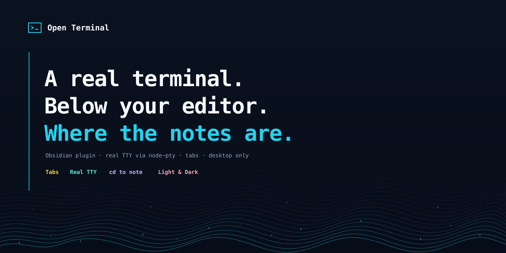
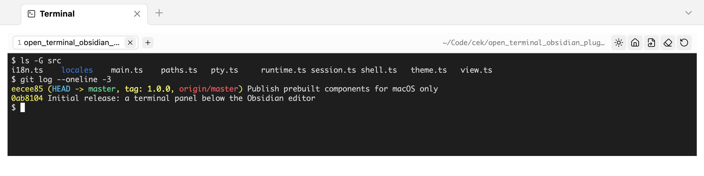

# Open Terminal Panel



A real terminal inside Obsidian. It opens as a panel **below the editor** — where a
terminal belongs in an editor window — and keeps several shells in tabs.

Not a fake shell: every tab gets a real TTY, so `vim`, `htop`, `git rebase -i`, a dev
server and colored output all behave the way they do in your terminal app.

> Desktop only. The plugin drives a native pty and cannot run on mobile.



## What it does

- **Opens below the editor**, and comes back on the next start if you left it open. Its height is a
  share of the editor area that you set once; the divider stays draggable.
- **Tabs.** Each tab is its own shell. Closing one kills that shell and nothing else,
  and a shell that exits keeps its output so you can still read what happened.
- **Jump to a folder.** One button types `cd` to the vault, another to the folder of
  the note you are editing. Paths are quoted, so a folder named `$(id)` is typed, not
  executed.
- **Its own palette.** Light or dark, deliberately independent of the Obsidian theme:
  the 16 ANSI colors need a fixed contrast baseline to stay readable.
- **Six interface languages**, following Obsidian by default.

## Install

### From the community store

Install and enable **Open Terminal Panel**, then open the panel. The first time, it asks to
download one more piece: `node-pty`, the native module that provides the TTY.

The store only ever installs `main.js`, `manifest.json` and `styles.css`, so a native
binary cannot travel with a plugin. Instead the panel shows the exact URL — an asset
on this repository's own release, matching the plugin version and your platform — and
waits for you to press the button. Nothing is downloaded in the background, and the
archive is unpacked only into the plugin's own folder. The SHA-256 of what was
downloaded is printed after the install, and the same checksum is published next to
the release as `node-pty-<platform>.tar.gz.sha256.txt`.

To do it yourself instead, unpack that archive into
`<vault>/.obsidian/plugins/open-terminal-panel/`.

Prebuilt components are published for macOS on Apple silicon and Intel — those are
the builds this project can produce and verify. On Windows or Linux the panel says so
and you install from source instead, which builds `node-pty` on the machine itself.

### From source

```bash
git clone https://github.com/aione314159/open-terminal.git
cd open-terminal
./cli/install_obsidian_plugin.sh            # first vault found in obsidian.json
./cli/install_obsidian_plugin.sh /path/to/vault
```

This builds the bundle, copies it into the vault, and installs `node-pty` from your
own `npm install` — so the download step never appears. Then reload community plugins
in Obsidian and enable **Open Terminal Panel**.

## Use

| Where | What |
|---|---|
| Ribbon icon | Open the panel |
| Command palette | Open / toggle the panel, new tab |
| `+` in the tab strip | New tab in the configured working folder |
| Middle click a tab | Close it |
| Header buttons | cd to vault · cd to the note's folder · clear · restart · light/dark |

A tab whose shell has exited keeps its output, struck through in the tab strip. Press
restart to get a live shell back in the same folder.

## Settings

| Setting | Default | Notes |
|---|---|---|
| Working folder | vault folder | Where new tabs start. `~` is expanded. A folder that no longer exists falls back to the vault. |
| Shell path | `$SHELL` | Started as a login shell, so `PATH` and your profile are complete — Obsidian is launched from the GUI and inherits almost nothing. |
| Always open on startup | off | Opens the panel on every start. Off, the panel follows the saved workspace: it comes back only if it was open when you quit. |
| Panel height | 30 % | Share of the editor area. |
| Palette | dark | Terminal only; does not follow the Obsidian theme. |
| Font size | 12 px | Applies to every tab. |
| Interface language | follow Obsidian | English and 繁體中文 are reviewed; 日本語, 한국어, Deutsch, Français are community translations. |

"Test the setup" in the settings tab checks the shell path, the working folder and
whether the native component is installed.

## How it works

```
main.ts      plugin, settings tab, panel placement below the editor
view.ts      the panel: tab strip, header actions, one visible session
session.ts   one shell — an xterm instance bound to a pty
runtime.ts   first-run download and unpack of the native component
pty.ts       loads node-pty from the plugin folder by absolute path
theme.ts     the two 16-color palettes
i18n.ts      string lookup; tables live in src/locales/
```

`node-pty` is native and cannot be bundled by esbuild, nor is it on Obsidian's module
resolution path — hence loading it by absolute path out of the plugin folder, and
hence the first-run download that puts it there.

Placing the panel uses `createLeafBySplit` on the most recent leaf of the root split,
so it lands under the editor rather than inside a sidebar. Its height is set through
`setDimension` on the leaf's tab container — and on every sibling, because a container
left unsized is treated as "as small as possible" and the terminal would take the
whole area. `setDimension` is not public API; if a future Obsidian release drops it,
the panel simply opens at the default split height and stays usable.

## Development

```bash
npm install
npm run dev      # esbuild watch
npm run build    # tsc --noEmit + production bundle

./cli/pack_pty_runtime.sh          # build the node-pty archive for this platform
node cli/test_unpack.mjs           # unpack it with the plugin's own reader and verify
```

Adding a language means one file in `src/locales/` and one line in its `index.ts`.
`src/locales/zh.ts` is the source of truth for the key set — the build fails if any
other table is missing a key.

Releasing: tag the commit with the version in `manifest.json`, attach `main.js`,
`manifest.json`, `styles.css` and the `node-pty-<platform>.tar.gz` archives with their
`.sha256.txt` files.

## License

MIT
