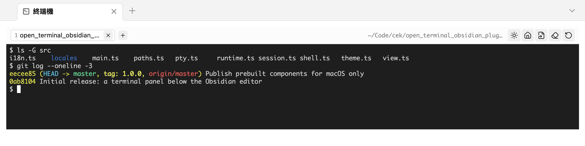

# Open Terminal Panel


Obsidian 裡的真終端機。面板開在**編輯區下方**——編輯器裡的終端機本來就該在那裡——並且用分頁裝好幾個 shell。

不是模擬的殼：每個分頁都有真正的 TTY，所以 `vim`、`htop`、`git rebase -i`、跑 dev server、帶顏色的輸出，行為都跟你平常的終端機一樣。

> 僅限桌面版。插件要驅動原生 pty，行動版無法執行。



## 它做什麼

- **開在編輯區下方**，離開時面板是開著的，下次啟動就會回來。高度是編輯區的比例，設定一次即可，之後仍可直接拖曳分隔線。
- **分頁。** 每個分頁是獨立的 shell，關掉一個不影響其他；shell 結束後輸出會留著，讓你還看得到剛才發生什麼事。
- **一鍵跳目錄。** 一顆按鈕送 `cd` 到 vault，另一顆到你正在編輯的筆記所在資料夾。路徑會加引號，所以名為 `$(id)` 的資料夾是被「打字」進去，不是被執行。
- **自己的配色。** 淺色或深色，刻意不跟隨 Obsidian 主題：終端機的 16 個 ANSI 色需要固定的對比基準才讀得清楚。
- **六種介面語言**，預設跟隨 Obsidian。

## 安裝

### 從社群商店

安裝並啟用 **Open Terminal Panel**，然後開啟面板。第一次會請你下載一個元件：`node-pty`，也就是提供 TTY 的原生模組。

商店只會安裝 `main.js`、`manifest.json` 與 `styles.css`，原生二進位沒辦法跟著插件一起送達。所以面板會把確切網址攤出來給你看——本專案 release 上的附件，對應你的插件版本與平台——然後等你按下按鈕。不會有背景下載，解開的檔案也只寫進插件自己的資料夾。安裝完會印出下載內容的 SHA-256，同一份校驗碼也發布在 release 旁邊的 `node-pty-<platform>.tar.gz.sha256.txt`。

想自己來，就把那個壓縮檔解開到 `<vault>/.obsidian/plugins/open-terminal-panel/`。

預建元件目前只發布 macOS（Apple silicon 與 Intel）——那是本專案做得出來也驗證得了的組合。Windows 與 Linux 上面板會直接說明，改走原始碼安裝，由機器自己編出 `node-pty`。

### 從原始碼

```bash
git clone https://github.com/aione314159/open-terminal.git
cd open-terminal
./cli/install_obsidian_plugin.sh            # obsidian.json 裡找到的第一個 vault
./cli/install_obsidian_plugin.sh /path/to/vault
```

腳本會建置、複製進 vault，並把你自己 `npm install` 出來的 `node-pty` 一起裝好——所以走這條路就不會看到下載步驟。接著在 Obsidian 重新載入社群插件，啟用 **Open Terminal Panel**。

## 使用

| 位置 | 動作 |
|---|---|
| Ribbon 圖示 | 開啟面板 |
| 指令面板 | 開啟／開關面板、新增分頁 |
| 分頁列的 `+` | 在設定的工作目錄開新分頁 |
| 中鍵點分頁 | 關閉它 |
| 面板右上按鈕 | cd 到 vault · cd 到筆記資料夾 · 清畫面 · 重啟 · 明暗切換 |

shell 結束的分頁會保留輸出，標題加刪除線。按重啟就能在同一個目錄拿回一個活的 shell。

## 設定

| 設定 | 預設 | 說明 |
|---|---|---|
| 工作目錄 | vault 資料夾 | 新分頁的起始目錄，支援 `~`。目錄不存在時退回 vault。 |
| Shell 路徑 | `$SHELL` | 以登入 shell 啟動，`PATH` 與 profile 才完整——Obsidian 從 GUI 啟動，幾乎什麼都繼承不到。 |
| 每次啟動都開啟 | 關 | 每次啟動都開面板。關閉時面板跟著 workspace 走：離開前是開著的才會回來。 |
| 面板高度 | 30 % | 佔編輯區的比例。 |
| 配色 | 深色 | 只影響終端機，不跟隨 Obsidian 主題。 |
| 字級 | 12 px | 套用到所有分頁。 |
| 介面語言 | 跟隨 Obsidian | English 與繁體中文經過校對；日本語、한국어、Deutsch、Français 為社群翻譯。 |

設定頁的「測試設定」會檢查 shell 路徑、工作目錄，以及原生元件是否已安裝。

## 運作方式

```
main.ts      插件本體、設定頁、面板在編輯區下方的擺放
view.ts      面板：分頁列、標題列動作、同時只顯示一個 session
session.ts   一個 shell —— 一個 xterm 綁一個 pty
runtime.ts   首次啟動時下載並解開原生元件
pty.ts       以絕對路徑從插件資料夾載入 node-pty
theme.ts     兩套 16 色配色
i18n.ts      字串查找；語系表在 src/locales/
```

`node-pty` 是原生模組，esbuild 打包不進去，也不在 Obsidian 的模組解析路徑上——所以才要用絕對路徑從插件資料夾載入，也才需要首次啟動時把它放到那裡。

面板擺放是對 root split 最近的 leaf 呼叫 `createLeafBySplit`，才會落在編輯區下方而不是側邊欄。高度是對 leaf 的分頁容器呼叫 `setDimension`——而且同層每一個都要設，因為沒設值的容器會被當成「越小越好」，終端機就會吃掉整個版面。`setDimension` 不是公開 API；未來 Obsidian 版本若拿掉它，面板只是以預設高度開啟，仍然可用。

## 開發

```bash
npm install
npm run dev      # esbuild watch
npm run build    # tsc --noEmit + production bundle

./cli/pack_pty_runtime.sh          # 為當前平台打包 node-pty 壓縮檔
node cli/test_unpack.mjs           # 用插件自己的解壓程式碼解開並驗證
```

加一個語言 = `src/locales/` 多一個檔案 + `index.ts` 多一行。`src/locales/zh.ts` 是 key 集合的來源，其他語系表缺 key 會編譯失敗。

發布：用 `manifest.json` 的版本號打 tag，附上 `main.js`、`manifest.json`、`styles.css`，以及各平台的 `node-pty-<platform>.tar.gz` 與對應的 `.sha256.txt`。

## 授權

MIT
